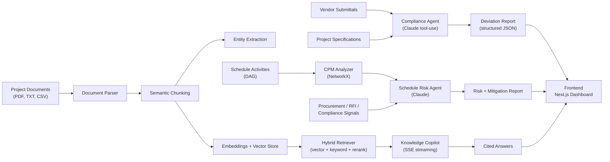

# AI Intelligence Platform — Data Centre EPC Delivery

> **Hackathon Entry · Industrial Intelligence / Infrastructure Construction / Quality Management**

An AI-powered EPC project intelligence platform for data centre construction that unifies project specifications, vendor submittals, schedules, procurement signals, RFIs, and quality records into a **living intelligence layer** — enabling proactive schedule management, automated compliance checking, and real-time commissioning support across the full project lifecycle.

---

## Problem Statement

India's data centre capacity is projected to grow from ~900 MW (2024) to over 2,700 MW by 2027 — a $15B+ build programme. A single hyperscale facility involves 15,000–40,000 equipment line items, up to 200 concurrent trade contractors, and thousands of commissioning test procedures. Yet 67% of data centre EPC projects in Asia-Pacific experience schedule overruns exceeding 10% (Turner & Townsend, 2024), driven by procurement misalignment and commissioning failures rooted in **information fragmentation**.

This platform adds an AI intelligence layer over EPC project data so teams can:
- Catch specification deviations **before** equipment reaches site
- Predict critical path schedule risks **weeks** in advance
- Answer project knowledge questions **instantly** with cited evidence

---

## Live Features

### 🏠 Project Dashboard
Real-time project health overview with KPI cards (documents indexed, compliance score, critical risks, open RFIs, schedule delay), animated project timeline progress bars per discipline (Civil, Electrical, HVAC, Commissioning), and a live activity feed showing document indexing and compliance events.

### 🤖 Knowledge Copilot (RAG AI)
Conversational AI over all project documents. Ask any technical or contractual question and receive a streamed answer with document citations (filename, clause, similarity score, page number). Powered by a hybrid retrieval pipeline: vector similarity + keyword search + reranking + context assembly.

**Example questions:**
- *"What is the required UPS battery autonomy?"*
- *"Which clauses define switchgear fault withstand rating?"*
- *"What are the IST commissioning requirements?"*

### 🛡️ Compliance Review (Specification Compliance Agent)
AI agent that compares project specifications against vendor submittals and generates structured deviation reports. Each finding is classified by:
- Requirement ID (e.g. `REQ-UPS-001`, `REQ-MV-001`)
- Compliance status: `Equivalent / Partial Match / Contradictory / Missing`
- Severity: `Critical / Major / Minor / Informational`
- Confidence score (0–100%)
- AI explanation + recommended action
- Linked source documents

Filter findings by severity. 8 requirements checked across Electrical, Mechanical, and Civil disciplines.

### 📅 Schedule Intelligence (Predictive Risk Engine)
Deterministic CPM critical path analysis combined with AI semantic risk reasoning:
- Builds a directed acyclic graph from schedule activities + dependencies
- Calculates ES, EF, LS, LF, Float, Critical Path
- Integrates procurement delays, open RFIs, and compliance issues
- Generates cascading **impact analysis** + actionable **mitigation strategies** per activity
- Interactive Gantt chart with animated bars (red = critical path, blue = float)

### 📁 Document Library
Unified technical documentation workspace with 14+ pre-loaded engineering documents:
- Unique cover pages per document (title, discipline stamp, revision, team sign-offs)
- Page navigation: Cover → Revision History → Technical Content sections
- Related requirements and risk register cross-references per document
- **Upload**: drag-and-drop pipeline animation → backend ingestion → live polling → auto-append on index
- **Delete**: hover-reveal trash icon → confirmation modal → instant removal

### ⚠️ Risk Center
9 risks across 4 disciplines (Electrical, Mechanical, Procurement, Civil) with:
- Probability/impact assessment
- Risk evidence and mitigation strategy
- Source document cross-references
- Compliance link per risk item
- Category tab filtering

### ⚙️ Settings
Platform configuration toggles for AI features and notifications.

---

## Architecture



---

## Tech Stack

### Backend
| Component | Technology |
|-----------|-----------|
| API Framework | FastAPI + Uvicorn |
| Database ORM | SQLAlchemy (SQLite local / PostgreSQL + pgvector production) |
| Background Tasks | Celery + Redis (falls back to synchronous mode) |
| AI / LLM | Anthropic Claude (tool-use for structured output, SSE streaming) |
| Embeddings | OpenAI text-embedding-3-small via LlamaIndex |
| PDF Parsing | PyMuPDF |
| Schedule Math | NetworkX (DAG / CPM) |
| Auth / Audit | JWT-ready audit logging, rate limiting middleware |

### Frontend
| Component | Technology |
|-----------|-----------|
| Framework | Next.js 15 (App Router) |
| Language | TypeScript |
| Animations | Framer Motion |
| Icons | Lucide React |
| Styling | Vanilla CSS (dark glassmorphism design system) |

---

## Repository Structure

```text
.
├── backend/
│   └── app/
│       ├── ai/                  # Claude gateway (stream + tool-use + mock fallback)
│       ├── config/              # Runtime settings (pydantic-settings)
│       ├── database/            # SQLAlchemy session + auto-schema init
│       ├── llm/                 # AI agents: compliance, schedule, copilot
│       ├── middleware/          # Rate limiting, request context
│       ├── models/              # Project, Document, Chunk, Embedding, Citation
│       ├── prompts/             # Versioned prompt registry
│       ├── rag/                 # Indexer, retriever, query expansion, reranker
│       ├── repositories/        # Repository pattern (Document, Chunk, Citation)
│       ├── routers/             # FastAPI routes: ingestion, copilot, compliance, schedule, health
│       ├── security/            # Audit logger
│       ├── services/            # Parser, entity extractor, schedule analyzer
│       └── tasks/               # Celery ingestion pipeline
├── frontend/
│   ├── app/
│   │   ├── dashboard/           # Project overview + KPIs
│   │   ├── knowledge/           # Knowledge Copilot (SSE streaming RAG)
│   │   ├── compliance/          # Compliance Review UI
│   │   ├── schedule/            # Schedule Intelligence + Gantt
│   │   ├── documents/           # Document Library + upload + delete
│   │   ├── risks/               # Risk Center
│   │   └── settings/            # Settings page
│   └── lib/
│       └── projectData.ts       # Shared data layer (documents, compliance, risks)
├── datasets/                    # Synthetic EPC demo datasets
├── documentation/               # SRS chapters
├── prompts/                     # Prompt version files
├── docker-compose.yml           # Redis for background task queue
└── .env.template                # Environment variable template
```

---

## API Reference

### Health
```http
GET /api/v1/health/
```
Returns: API status, database connection, vector DB, Claude connectivity.

### Document Ingestion
```http
POST /api/v1/ingestion/upload          # Upload PDF/TXT/CSV → parse → chunk → embed → index
GET  /api/v1/ingestion/status/{id}     # Poll processing status
GET  /api/v1/ingestion/                # List all indexed documents
DELETE /api/v1/ingestion/{id}          # Delete document (DB record + file cleanup)
```

### Knowledge Copilot
```http
POST /api/v1/copilot/query
Content-Type: application/json

{ "project_id": "default-project", "question": "What is the UPS battery autonomy?" }
```
Returns: Server-Sent Events stream with `text` and `citations` events.

### Compliance Analysis
```http
POST /api/v1/compliance/analyze
Content-Type: application/json

{
  "specification_text": "UPS shall provide N+1 redundancy. Battery autonomy minimum 15 minutes.",
  "vendor_text": "Proposed system uses N topology. Battery runtime 10 minutes base configuration."
}
```
Returns: `overall_score`, `total_findings`, `findings[]` (with severity, confidence, explanation, recommendation), `recommendation`.

### Schedule Risk Analysis
```http
POST /api/v1/schedule/analyze
Content-Type: application/json

{
  "activities": [
    { "id": "A1", "name": "Site Clearance", "duration": 5, "predecessors": [] },
    { "id": "A2", "name": "Switchgear Procurement", "duration": 15, "predecessors": [], "procurement_status": "Delayed", "open_rfis": 1 },
    { "id": "A3", "name": "Switchgear Installation", "duration": 5, "predecessors": ["A1", "A2"] },
    { "id": "A4", "name": "IST", "duration": 10, "predecessors": ["A3"] }
  ]
}
```
Returns: `project_duration`, `critical_path`, `activities[]` (with ES/EF/LS/LF/float), `ai_risk_mitigations[]`.

---

## Setup & Running

### Prerequisites
- Python 3.10+
- Node.js 20+
- Git

### 1. Clone
```bash
git clone https://github.com/tanisinghal0209/ai-hackathon-2026.git
cd ai-hackathon-2026
```

### 2. Environment Variables
```bash
cp .env.template .env
# Edit .env — minimum required for full AI features:
#   ANTHROPIC_API_KEY=sk-ant-...
#   OPENAI_API_KEY=sk-proj-...
#
# ⚡ Demo mode works WITHOUT API keys — all agents have smart mock fallbacks
```

### 3. Backend
```bash
cd backend
python -m venv venv
source venv/bin/activate          # Windows: venv\Scripts\activate
pip install -r ../requirements.txt
uvicorn app.main:app --host 0.0.0.0 --port 8000 --reload
```

### 4. Frontend
```bash
cd frontend
npm install
npm run dev
```

Open **http://localhost:3000**

### 5. (Optional) Redis + Celery for async ingestion
```bash
docker compose up -d redis
cd backend && source venv/bin/activate
celery -A app.worker.celery_app worker --loglevel=info
```
> Without Redis, ingestion runs synchronously (SYNC_INGESTION=true) — works fine for demo.

---

## Demo Mode (No API Key Required)

All three AI agents have **smart mock fallbacks** that activate automatically when no valid API key is present:

| Agent | Mock Behaviour |
|-------|---------------|
| Knowledge Copilot | Streams keyword-aware responses citing real spec clauses (`PHX-DC-01-EL-SPEC-002`, `REQ-UPS-002`) |
| Compliance Agent | Returns realistic structured findings for N+1, battery autonomy, THD, chiller COP, switchgear rating |
| Schedule Agent | CPM math always runs; AI narrative generated deterministically for delayed/critical activities |

Set `MOCK_LLM=true` in `.env` to force mock mode regardless of API key presence.

---

## Recommended Demo Flow (5 minutes)

| Step | Page | What to show |
|------|------|-------------|
| 1 | **Dashboard** | KPI cards, Live Activity feed, project timeline |
| 2 | **Knowledge Copilot** | Ask *"What is the UPS battery autonomy?"* → watch streaming + citation panel |
| 3 | **Compliance** | Run AI Analysis → click REQ-UPS-002 (Critical: 10min vs 15min required) |
| 4 | **Schedule** | Analyze → click Switchgear Procurement → read cascade impact + mitigation |
| 5 | **Documents** | Open UPS spec → show unique cover → navigate pages → upload a file |
| 6 | **Risk Center** | Show R-EL-01 with probability matrix and source document links |

---

## Evaluation Criteria Mapping

| Judging Criterion | Weight | How This Project Addresses It |
|-------------------|--------|-------------------------------|
| **Innovation** | 25% | Multi-agent AI platform: RAG copilot + compliance tool-use + CPM + semantic risk reasoning — purpose-built for EPC construction |
| **Business Impact** | 25% | Catches spec deviations before site (saves procurement re-work), predicts schedule delays 2–3 weeks early, reduces RFI cycle time |
| **Technical Excellence** | 20% | Claude tool-use for structured output, SSE streaming, CPM graph math, hybrid RAG retrieval, repository pattern, event publishing |
| **Scalability** | 15% | Docker-ready, Celery async queue, pgvector support, SQLite local fallback, repository pattern for DB portability |
| **User Experience** | 15% | Dark glassmorphism UI, Framer Motion animations, 3-panel layouts, real-time streaming, toast notifications, zero TypeScript errors |

---

## Challenge Statement Coverage

| Challenge Area | Implementation |
|----------------|---------------|
| Specification & Quality Compliance Agent | ✅ Compliance Review page — flags REQ-UPS-001 (N+1), REQ-UPS-002 (battery autonomy), REQ-MV-001 (switchgear), REQ-ME-001 (chiller COP), REQ-CV-001 (structural) |
| Predictive Schedule Risk Engine | ✅ Schedule Intelligence — real CPM DAG + AI mitigation for procurement delay, open RFI, compliance issues, critical path |
| Commissioning Quality Assurance Copilot | ✅ Knowledge Copilot — SSE streaming RAG with clause-level citations, commissioning procedure retrieval |
| Project Knowledge & RFI Intelligence Agent | ✅ Same copilot — answers technical + contractual queries with document evidence |
| Supply Chain Visibility & Risk Agent | ✅ Risk Center — R-PR-01/02/03 supply chain risks cross-referenced to procurement specs and delivery schedules |

---

## Project Pitch

**EPC.ai** helps data centre construction teams move from reactive coordination to proactive intelligence. Instead of waiting for procurement errors, unresolved RFIs, or commissioning failures to appear on site, the platform connects project documents, schedules, submittals, and quality records so risks are detected early, explained clearly, and resolved with evidence.

The goal: help EPC teams deliver complex Tier III and IV data centre projects with fewer delays, fewer quality escapes, and faster technical decision-making — so India can realise its ambitions as an AI infrastructure hub.
