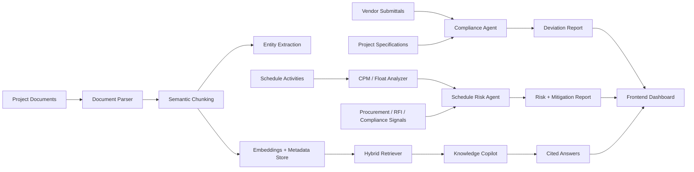

# AI Intelligence Platform for Data Centre EPC Project Delivery

An AI-powered EPC project intelligence platform for data centre construction. The prototype unifies project specifications, vendor submittals, schedules, procurement signals, RFIs, and quality records into a living intelligence layer that helps EPC teams detect specification deviations, predict schedule risks, and answer project knowledge questions with evidence.

This project was built for the **Industrial Intelligence / Infrastructure Construction / Quality Management** challenge.

## Problem Context

India's data centre build-out is accelerating rapidly, with hyperscale facilities requiring tens of thousands of equipment line items, hundreds of concurrent contractors, and complex commissioning sequences across electrical, mechanical, cooling, and IT systems. In this environment, project data is usually fragmented across specifications, submittals, RFIs, schedules, test records, and change orders.

That fragmentation creates three major delivery risks:

- **Specification deviations** are found too late, after procurement or installation.
- **Schedule risks** surface only after they already affect the critical path.
- **Project knowledge** stays buried in documents, emails, RFIs, and meeting records.

This platform adds an AI intelligence layer over EPC project data so project teams can catch issues earlier and make faster, evidence-backed decisions.

## Prototype Scope

The current prototype focuses on three high-value workflows from the challenge statement:

### 1. Specification & Quality Compliance Agent

Compares project specifications against vendor submittals and generates a structured deviation report.

Current capabilities:

- Accepts specification text and vendor submittal text.
- Uses an LLM tool-calling workflow to flag deviations.
- Classifies each finding by compliance status, severity, confidence, explanation, and recommended action.
- Produces an overall compliance score and review recommendation.

Example use case:

> The project specification requires 15 minutes UPS battery autonomy at full load, but the vendor submittal proposes 10 minutes. The agent flags this as a major or critical deviation before the equipment reaches site.

### 2. Predictive Schedule Risk Engine

Analyzes EPC schedule activities using deterministic critical path logic and AI-generated mitigation reasoning.

Current capabilities:

- Builds a directed acyclic graph from schedule activities and dependencies.
- Calculates earliest start, earliest finish, latest start, latest finish, float, and critical path.
- Combines schedule logic with procurement delays, open RFIs, and compliance issues.
- Generates cascading impact analysis and mitigation strategies.

Example use case:

> A delayed switchgear procurement activity has an open RFI and feeds into integrated systems testing. The engine identifies the downstream commissioning risk and recommends mitigation actions.

### 3. Project Knowledge & RFI Intelligence Copilot

Provides a conversational RAG layer over project documents.

Current capabilities:

- Ingests project documents.
- Parses and chunks technical content.
- Stores metadata such as section headings, clause identifiers, engineering discipline, equipment category, and semantic role.
- Performs hybrid retrieval using vector search, keyword search, query expansion, reranking, and context assembly.
- Streams answers with supporting evidence.

Example use case:

> A project engineer asks: "What are the UPS redundancy and battery autonomy requirements?" The copilot retrieves relevant clauses and answers with citations.

## Architecture



## Tech Stack

### Backend

- **FastAPI** for REST APIs.
- **SQLAlchemy** for database models and sessions.
- **Celery + Redis** for background document ingestion.
- **NetworkX** for schedule graph and critical path calculations.
- **Anthropic Claude** for compliance, schedule reasoning, and copilot responses.
- **OpenAI embeddings** through LlamaIndex for document retrieval.
- **pgvector** model support for vector storage.
- **PyMuPDF** for PDF parsing.

### Frontend

- **Next.js**
- **React**
- **TypeScript**
- Custom CSS pages for dashboard, compliance review, schedule risk, and knowledge copilot.

## Repository Structure

```text
.
├── backend/
│   └── app/
│       ├── config/              # Runtime configuration
│       ├── database/            # SQLAlchemy session setup
│       ├── llm/                 # LLM agents and prompt assembly
│       ├── models/              # Project, document, chunk, embedding, citation models
│       ├── rag/                 # Indexing, retrieval, query expansion, reranking
│       ├── routers/             # FastAPI routes
│       ├── services/            # Parsing, entity extraction, schedule analysis
│       └── tasks/               # Celery ingestion tasks
├── frontend/
│   ├── app/
│   │   ├── compliance/          # Compliance review UI
│   │   ├── copilot/             # Knowledge copilot UI
│   │   └── schedule/            # Schedule risk UI
│   └── components/              # Shared UI components
├── prompts/                     # Prompt versions
└── docker-compose.yml           # Redis service for background tasks
```

## API Overview

### Health

```http
GET /api/v1/health
```

Checks backend service health.

### Document Ingestion

```http
POST /api/v1/ingestion/upload
GET /api/v1/ingestion/status/{document_id}
```

Uploads a PDF or CSV and queues it for parsing, chunking, entity extraction, and embedding.

### Knowledge Copilot

```http
POST /api/v1/copilot/query
```

Streams an answer to a project question using retrieved document context.

### Compliance Review

```http
POST /api/v1/compliance/analyze
```

Request body:

```json
{
  "specification_text": "UPS shall provide 15 minutes autonomy at full load.",
  "vendor_text": "UPS battery autonomy is 10 minutes at full load."
}
```

Returns a structured compliance report with deviations, severity, confidence, and recommendation.

### Schedule Risk

```http
POST /api/v1/schedule/analyze
```

Request body:

```json
{
  "activities": [
    {
      "id": "A1",
      "name": "Site Clearance",
      "duration": 5,
      "predecessors": [],
      "procurement_status": "Clear"
    },
    {
      "id": "A2",
      "name": "Switchgear Procurement",
      "duration": 15,
      "predecessors": [],
      "procurement_status": "Delayed",
      "open_rfis": 1
    }
  ]
}
```

Returns project duration, critical path, enriched activity float data, and AI-generated risk mitigations.

## Setup

### Prerequisites

- Python 3.10+
- Node.js 20+
- Redis
- API keys for:
  - `ANTHROPIC_API_KEY`
  - `OPENAI_API_KEY`

### Environment Variables

Create a `.env` file or export these variables before running the backend:

```bash
ANTHROPIC_API_KEY=your_anthropic_key
OPENAI_API_KEY=your_openai_key
REDIS_URL=redis://localhost:6379/0
SUPABASE_URL=
SUPABASE_KEY=
DATABASE_URL=
```

Notes:

- If no PostgreSQL/Supabase URL is provided, the backend defaults to local SQLite at `backend/app.db`.
- Full vector search is designed for a PostgreSQL + pgvector setup. SQLite is useful for local development, but pgvector-specific retrieval requires PostgreSQL with pgvector enabled.

### Start Redis

```bash
docker compose up -d redis
```

### Backend Setup

The backend dependency manifest is still pending. Until `requirements.txt` or `pyproject.toml` is added, install the packages used by the current app:

```bash
cd backend
python -m venv venv
source venv/bin/activate
pip install fastapi uvicorn pydantic-settings sqlalchemy celery redis networkx anthropic llama-index-embeddings-openai pgvector PyMuPDF sse-starlette python-multipart
```

Run the FastAPI server:

```bash
cd backend
source venv/bin/activate
uvicorn app.main:app --reload --port 8000
```

Run the Celery worker in a second terminal:

```bash
cd backend
source venv/bin/activate
celery -A app.worker.celery_app worker --loglevel=info
```

### Frontend Setup

```bash
cd frontend
npm install
npm run dev
```

Open:

```text
http://localhost:3000
```

The frontend expects the backend at:

```text
http://localhost:8000
```

## Demo Flow

Use this sequence for a hackathon presentation:

The repo includes a synthetic demo dataset in `datasets/`. Use it to run the prototype without needing confidential EPC project files. It contains a UPS/switchgear project specification, a non-compliant vendor submittal, schedule activities, an RFI log, procurement status data, commissioning checklist data, and ready-to-send API payloads.

### 1. Open the Dashboard

Show the platform as a central control layer for EPC project intelligence:

- Active RFIs
- Compliance deviations
- Critical schedule risks

### 2. Run Compliance Review

Paste a project specification and a vendor submittal.

Suggested test case:

Specification:

```text
REQ-UPS-001: UPS shall be configured in N+1 redundancy.
REQ-UPS-002: Battery autonomy shall be minimum 15 minutes at full IT load.
REQ-UPS-003: UPS output voltage shall be 415V, 3-phase, 50Hz.
REQ-UPS-004: UPS shall comply with IEC 62040.
```

Vendor submittal:

```text
The proposed UPS system is configured as N redundancy.
Battery runtime is 10 minutes at full load.
Output voltage is 415V, 3-phase, 50Hz.
Compliance is declared against IEC 62040.
```

Expected result:

- Flags redundancy mismatch.
- Flags battery autonomy shortfall.
- Keeps voltage and IEC compliance as acceptable.
- Generates action recommendation.

### 3. Run Schedule Risk Analysis

Use the built-in dummy EPC schedule on the schedule page.

Expected result:

- Calculates critical path and float.
- Highlights procurement delay and open RFI constraints.
- Produces cascading impact and mitigation suggestions.

### 4. Ask the Knowledge Copilot

After ingesting project documents, ask questions such as:

```text
What are the UPS redundancy requirements?
Which clauses define battery autonomy?
Are there any commissioning requirements for integrated systems testing?
Has a similar RFI been resolved before?
```

Expected result:

- Retrieves relevant document chunks.
- Streams an answer.
- Shows supporting evidence.

## Evaluation Mapping

| Challenge Evaluation Area | How This Prototype Addresses It |
| --- | --- |
| Specification compliance detection accuracy | Compliance agent compares requirements against vendor submittals and flags non-conformances. |
| Schedule risk prediction lead time | Schedule engine combines critical path, float, procurement status, RFIs, and compliance issues to identify risks before site impact. |
| Supply chain visibility depth | Current prototype models procurement delay signals inside schedule risk analysis. Full geospatial shipment tracking is a roadmap item. |
| Commissioning test automation coverage | Current prototype can reason over commissioning clauses through the knowledge copilot. Guided commissioning workflows are a roadmap item. |
| Reduction in manual coordination effort | Copilot, compliance review, and schedule risk pages reduce manual document search, submittal comparison, and schedule-risk triage. |

## Current Status

Implemented:

- FastAPI backend structure.
- Compliance analysis endpoint.
- Schedule analysis endpoint.
- Knowledge copilot endpoint with streaming.
- Document ingestion route and Celery task.
- Document parser, chunk metadata, entity extraction, embeddings, and hybrid retrieval logic.
- Next.js frontend pages for dashboard, compliance, schedule, and copilot.

In progress / needs completion:

- Backend dependency manifest.
- Database initialization and migration workflow.
- Production-ready PostgreSQL + pgvector setup.
- Demo seed documents and sample EPC datasets.
- Mock/fallback responses for offline judging.
- Documents page in frontend.
- Authentication and project-level access control.
- End-to-end test coverage.

## Roadmap

High-impact next steps:

1. Add realistic seeded data for UPS, switchgear, generators, cooling systems, RFIs, and commissioning test records.
2. Add a demo mode that works without live API keys.
3. Add a database migration or initialization script.
4. Add a document management page for upload/status tracking.
5. Connect compliance findings into schedule risk automatically.
6. Add commissioning QA workflows for integrated systems testing.
7. Add supply chain visibility for long-lead equipment.
8. Create presentation deck, architecture diagram, and demo video.

## Project Pitch

**AI EPC Intelligence Platform** helps data centre construction teams move from reactive coordination to proactive intelligence. Instead of waiting for procurement errors, unresolved RFIs, or commissioning failures to appear on site, the platform connects project documents, schedules, submittals, and quality records so risks can be detected early, explained clearly, and resolved with evidence.

The goal is to help EPC teams deliver complex Tier III and Tier IV data centre projects with fewer delays, fewer quality escapes, and faster technical decision-making.
