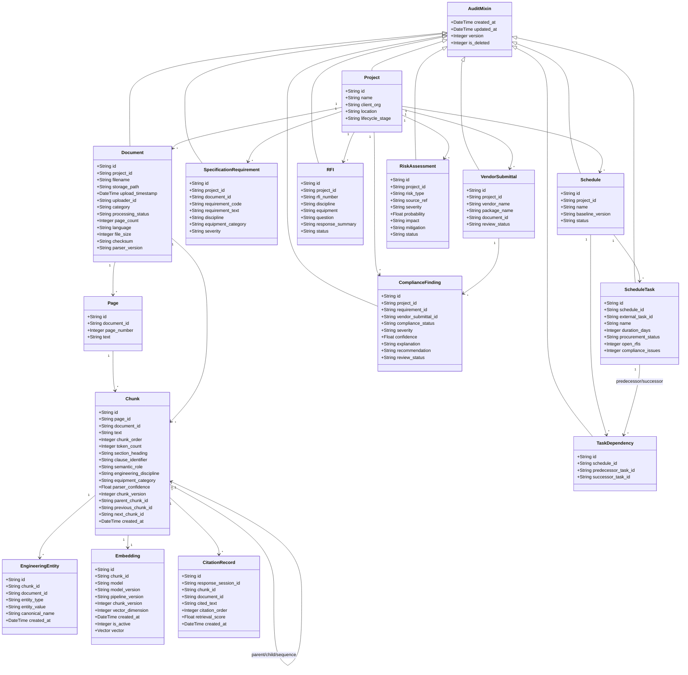
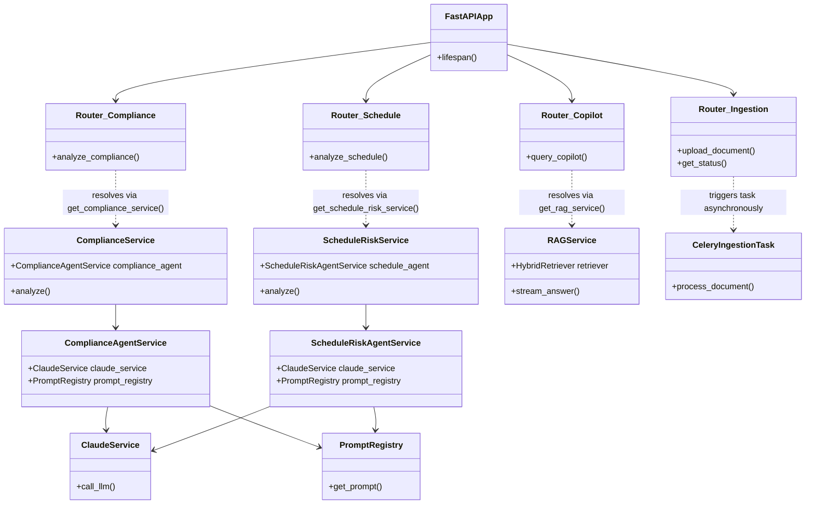
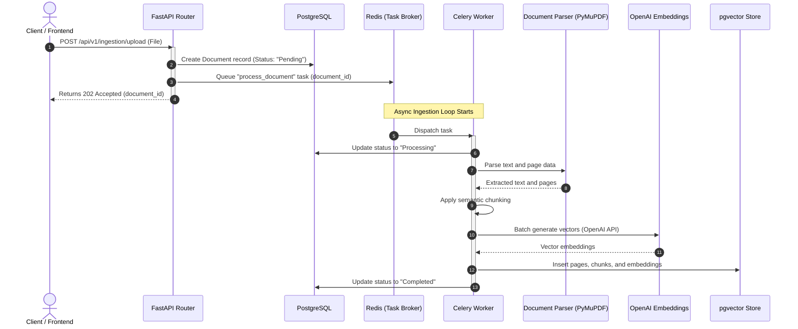
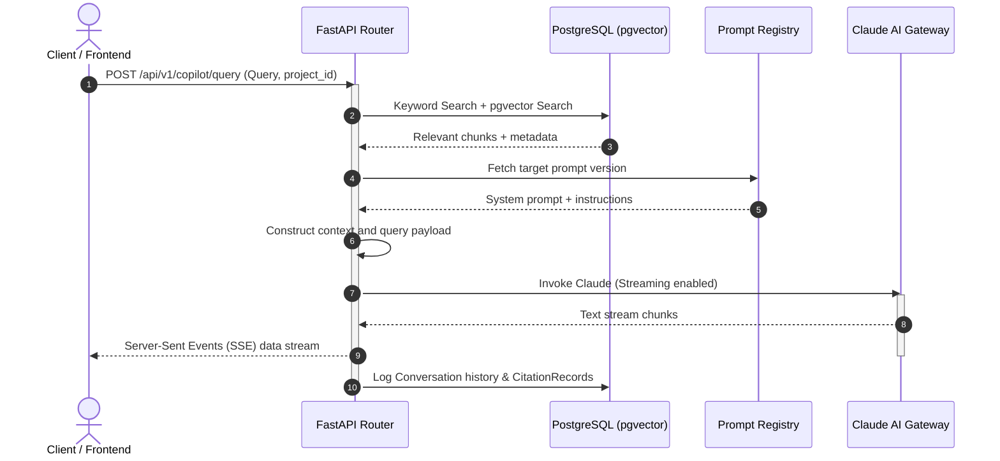
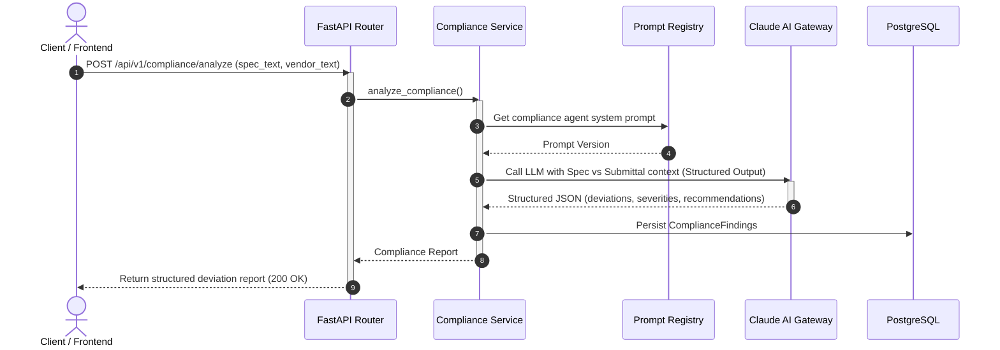
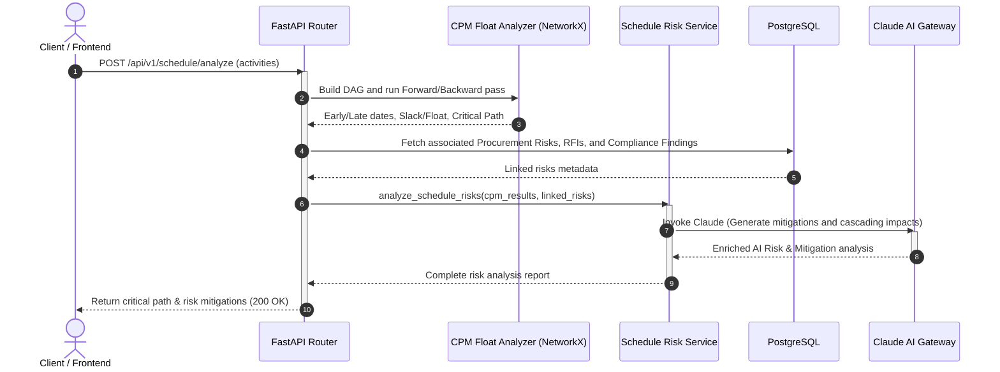
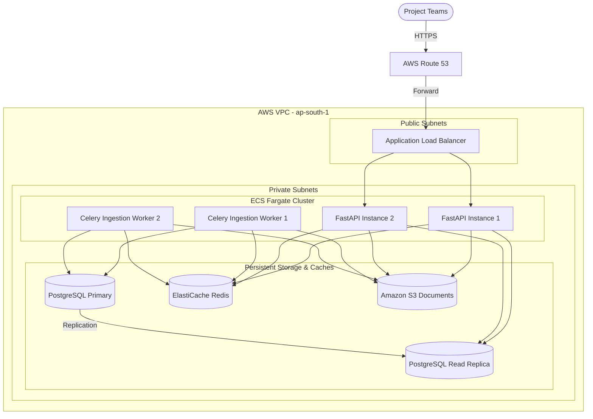

# Volume 1 — Software Requirements Specification (SRS)
# Chapter 21 — Backend Engineering Architecture (Continued)

## 21.31 FastAPI Application Lifecycle

The FastAPI application shall follow a deterministic startup and shutdown lifecycle. Rather than lazily initialising expensive resources during the first incoming request, all shared infrastructure shall be created during application startup.

During startup, the application loads configuration values from environment variables, validates mandatory settings, establishes database connection pools, initialises Redis clients, prepares Celery communication channels, loads prompt templates, registers dependency injection containers, configures logging, and verifies connectivity to external AI providers.

Application readiness shall only be reported after every mandatory dependency has been successfully initialised.

Likewise, graceful shutdown procedures shall close database sessions, flush pending logs, terminate background workers safely, release Redis connections, and dispose of shared resources. Abrupt termination should never leave partially completed ingestion workflows or uncommitted transactions.

This lifecycle ensures predictable application behaviour across development, staging, and production environments.

### Engineering Decision Record 21-L

Infrastructure dependencies shall be initialised during application startup rather than on first use.

**Reason:** Early failure detection simplifies deployment while avoiding unpredictable latency during the first user request.

---

## 21.32 Dependency Injection Architecture

FastAPI's dependency injection mechanism shall serve as the backbone of service composition.

Every request receives only the dependencies required for that execution path.

For example, a Knowledge Copilot request requires access to the Retrieval Service, Claude Gateway, Prompt Registry, Citation Validator, and Query Repository. It does not require Schedule Analysis or Compliance Services.

Dependencies shall be resolved through provider functions rather than instantiated manually.

This approach enables unit testing with mocked implementations, simplifies future provider replacement, and prevents uncontrolled object creation throughout the codebase.

Shared infrastructure such as database sessions and configuration objects shall be scoped appropriately to avoid unnecessary resource allocation.

---

## 21.33 SQLAlchemy Model Design

Database entities shall be represented through SQLAlchemy ORM models.

Each model represents one business concept rather than one application feature.

Core models include:
- `Project`
- `Document`
- `Page`
- `Chunk`
- `Embedding`
- `SpecificationRequirement`
- `VendorSubmittal`
- `RFI`
- `Schedule`
- `ScheduleTask`
- `TaskDependency`
- `ProcurementItem`
- `ComplianceFinding`
- `RiskAssessment`
- `PromptVersion`

Every model shall include common audit fields such as creation timestamp, update timestamp, and version identifier where appropriate.

Relationships shall be defined explicitly through foreign keys and ORM associations. Cascading behaviour must be carefully controlled to prevent accidental deletion of engineering evidence.

Soft deletion shall be preferred for business records whose historical traceability is important.

### Engineering Decision Record 21-M

Engineering records shall favour soft deletion over permanent removal.

**Reason:** Engineering workflows require historical traceability for audits, investigations, and project reviews.

---

## 21.34 Pydantic Schema Layer

The platform shall distinguish between persistence models and API schemas.

SQLAlchemy models represent internal database structure.

Pydantic schemas represent external API contracts.

This separation prevents accidental exposure of internal implementation details while allowing independent evolution of database and API designs.

For each major entity, separate schemas shall exist for creation, update, retrieval, and summary operations.

For example, the Document entity may expose:
- `DocumentCreateSchema`
- `DocumentUpdateSchema`
- `DocumentSummarySchema`
- `DocumentDetailSchema`

This pattern enables fine-grained validation while simplifying frontend integration.

---

## 21.35 Validation Strategy

Input validation shall occur before business logic executes.

Validation operates at multiple levels.

The transport layer validates request structure and data types.

Business validation confirms that project rules are satisfied.

AI validation confirms structured model outputs.

Persistence validation ensures database consistency.

Validation failures shall produce informative, machine-readable error responses describing the exact field or business rule responsible for rejection.

The backend shall reject invalid requests immediately rather than attempting automatic correction unless explicitly designed to do so.

### Engineering Decision Record 21-N

Validation shall occur as early as possible within the request lifecycle.

**Reason:** Early rejection reduces unnecessary computation while improving error transparency.

---

## 21.36 Authentication Architecture

Although the hackathon prototype may operate using a single demonstration account, the backend shall be designed with future multi-user support in mind.

Authentication responsibilities remain isolated within a dedicated security module.

Future authentication providers may include Supabase Authentication, Auth0, Azure Active Directory, or enterprise SSO solutions.

Business services shall never contain authentication logic.

Instead, authenticated user context shall be injected into requests after successful verification.

This separation enables future authentication changes without modifying application business rules.

---

## 21.37 Authorization Model

Authorization determines what authenticated users are permitted to access.

The platform shall adopt role-based access control.

Illustrative roles include:
- Project Administrator
- Project Manager
- Planning Engineer
- Quality Engineer
- Commissioning Engineer
- Vendor
- Client Representative
- Auditor

Permissions shall be expressed through capabilities rather than hardcoded role checks.

For example, the capability "Approve Compliance Findings" may be assigned to multiple roles.

This model remains flexible as organisational structures evolve.

### Engineering Decision Record 21-O

Permissions shall be capability-based rather than role-dependent.

**Reason:** Capabilities provide greater flexibility than embedding business rules directly within role definitions.

---

## 21.38 API Versioning

Every public API shall belong to an explicit version.

The initial release shall expose endpoints beneath: `/api/v1/`

Future incompatible changes shall introduce new versions rather than modifying existing contracts.

Backward compatibility shall be maintained wherever practical.

Deprecation policies shall communicate upcoming API removals before implementation.

This strategy enables frontend evolution without simultaneous backend replacement.

---

## 21.39 Rate Limiting

AI inference represents one of the most expensive backend operations.

The platform shall therefore implement configurable rate limiting.

Different endpoint categories may enforce different thresholds:
- Document uploads
- Knowledge queries
- Compliance analysis
- Schedule analysis
- Administrative operations

Rate limiting shall occur before AI invocation to prevent unnecessary provider costs during abusive or accidental request patterns.

Future enterprise deployments may apply limits per organisation, project, or user.

### Engineering Decision Record 21-P

Expensive AI operations shall always be protected through rate limiting.

**Reason:** AI inference costs scale directly with request volume.

---

## 21.40 Backend Testing Strategy

Testing shall occur across multiple independent layers:
- **Unit tests** verify individual services in isolation using mocked dependencies.
- **Repository tests** validate persistence behaviour against temporary databases.
- **Integration tests** verify interactions between services.
- **API tests** validate request and response contracts.
- **AI evaluation tests** measure retrieval quality and structured output correctness.
- **End-to-end tests** exercise complete workflows beginning with document upload and ending with dashboard presentation.
- **Performance tests** evaluate ingestion throughput, retrieval latency, embedding generation time, and concurrent request handling.
- **Regression suites** execute benchmark engineering scenarios after every significant modification.

The objective extends beyond code correctness to ensuring that engineering reasoning remains stable as the platform evolves.

---

## 21.41 Logging Standards

Every backend component shall produce structured logs rather than free-form text.

Every log entry shall include:
- Timestamp
- Correlation identifier
- Request identifier
- User identifier where available
- Service name
- Operation name
- Execution duration
- Result status
- Error classification if applicable

Structured logs enable automated monitoring, search, and distributed tracing while reducing ambiguity during debugging.

---

## 21.42 Configuration Hierarchy

Configuration values shall originate from clearly defined sources.

The precedence order shall be:
1. Runtime environment variables
2. Environment-specific configuration files
3. Application defaults

Hardcoded constants shall be avoided except where values are genuinely immutable.

Configuration categories include infrastructure, AI providers, storage, retrieval behaviour, prompt versions, feature flags, logging, monitoring, and security.

This hierarchy simplifies deployment across development, staging, and production environments.

---

## 21.43 Service Dependency Graph

Although the backend has been described as a collection of independent services, no service operates entirely in isolation. Understanding the dependency graph is essential for maintaining modularity while preventing circular references.

At the centre of the architecture sits the Orchestrator Layer. Orchestrator services coordinate complete business workflows but avoid implementing low-level functionality themselves.

The Document Ingestion Orchestrator depends upon the Parser Service, Metadata Service, Chunk Generation Service, Embedding Service, Vector Indexing Service, Storage Service, and Notification Service. Each of these supporting services remains unaware of one another and communicates only with the orchestrator.

Similarly, the Knowledge Copilot Orchestrator coordinates the Retrieval Service, Prompt Builder, Claude Gateway, Citation Validator, and Response Formatter. These supporting services remain interchangeable because they communicate through well-defined interfaces rather than concrete implementations.

By restricting dependencies to a hierarchical structure, the architecture eliminates circular imports and significantly simplifies testing.

### Engineering Decision Record 21-Q

Dependencies shall always point downward through the architectural hierarchy.

**Reason:** Unidirectional dependencies reduce coupling, simplify dependency injection, and prevent circular service relationships.

### 21.43.1 Domain Model (Entity-Relationship Layout)



### 21.43.2 Dependency Resolution and Service Architecture



---

## 21.44 Sequence Diagram — Document Upload

The document upload workflow illustrates how the backend processes engineering documentation asynchronously.

The sequence begins when an engineer uploads a specification through the frontend.

The frontend sends the document to the Upload API.

The Upload Controller validates the request and delegates processing to the Document Ingestion Orchestrator.

The orchestrator creates an initial document record, stores the binary file in object storage, and publishes a DocumentUploadedEvent.

The HTTP request returns immediately with a processing identifier.

Background workers then consume the event.

The parser extracts structured content.

Metadata extraction follows.

Chunk generation executes next.

Embeddings are generated.

Vectors are indexed.

Finally, a DocumentReadyEvent notifies the frontend that the knowledge base now includes the uploaded specification.

This asynchronous design ensures that even thousand-page engineering specifications never block user interaction.



---

## 21.45 Sequence Diagram — Knowledge Query

Knowledge retrieval follows a separate execution path.

A user submits an engineering question through the frontend.

The Query Controller validates the request before invoking the Knowledge Service.

The Retrieval Service analyses user intent, expands the query, applies metadata filters, executes hybrid retrieval, reranks candidate chunks, and assembles evidence.

The Prompt Builder constructs the Claude prompt using retrieved evidence.

The Claude Gateway performs inference.

Structured responses return to the Citation Validator.

Validated responses proceed to the Response Formatter.

Finally, the API streams the answer to the frontend using Server-Sent Events.

Throughout this workflow, retrieved evidence remains completely separate from generated reasoning, ensuring explainability.



---

## 21.46 Sequence Diagram — Compliance Analysis

Compliance analysis demonstrates collaboration between deterministic software and language models.

The engineer selects a specification together with a vendor submittal.

The Compliance Controller delegates execution to the Compliance Orchestrator.

Requirement extraction retrieves structured engineering requirements from the specification.

Vendor parsing extracts structured equipment attributes.

The Alignment Engine establishes candidate requirement pairs.

The Rule Engine executes deterministic comparisons.

Only unresolved or semantic requirements proceed to Claude.

Claude returns structured findings.

The Validation Service verifies schema correctness.

Findings are persisted.

The frontend receives a structured compliance report suitable for engineering review.

Every intermediate artefact remains available for later inspection.



---

## 21.47 Sequence Diagram — Schedule Risk Analysis

Schedule analysis combines graph algorithms with AI reasoning.

The planner uploads a project schedule.

The Schedule Service validates structural integrity.

NetworkX constructs the dependency graph.

Critical path analysis executes.

Float calculations follow.

Procurement, RFIs, and compliance findings enrich deterministic schedule data.

Risk scores are calculated mathematically.

Only after deterministic analysis completes does Claude receive structured summaries.

Claude generates engineering narratives and mitigation recommendations.

These recommendations return to PostgreSQL before appearing within the project dashboard.

This separation ensures that mathematical correctness never depends upon probabilistic AI behaviour.

### Engineering Decision Record 21-R

Language models shall consume deterministic engineering results rather than raw project data whenever practical.

**Reason:** Separating computation from explanation improves reliability while reducing token consumption.



---

## 21.48 Containerisation Strategy

Every backend component shall execute inside Docker containers.

Containerisation guarantees identical execution environments across development, testing, and production.

Separate containers include:
- FastAPI Application
- Celery Workers
- Redis
- PostgreSQL
- Reverse Proxy
- Future Monitoring Stack
- Object Storage Emulator (Development)

The frontend remains independently containerised, allowing both applications to scale separately.

Environment-specific configuration shall be injected during deployment rather than baked into container images.

### 21.48.1 Backend Multi-Stage Dockerfile (`Dockerfile.backend`)

```dockerfile
# Stage 1: Build dependencies
FROM python:3.10-slim AS builder

WORKDIR /build

ENV PYTHONDONTWRITEBYTECODE=1 \
    PYTHONUNBUFFERED=1

RUN apt-get update && apt-get install -y --no-install-recommends \
    build-essential \
    libpq-dev \
    && rm -rf /var/lib/apt/lists/*

COPY requirements.txt .
RUN pip install --no-cache-dir --user -r requirements.txt

# Stage 2: Runtime image
FROM python:3.10-slim AS runner

WORKDIR /app

RUN apt-get update && apt-get install -y --no-install-recommends \
    libpq5 \
    curl \
    && rm -rf /var/lib/apt/lists/*

COPY --from=builder /root/.local /root/.local
COPY . /app

ENV PATH=/root/.local/bin:$PATH
ENV PYTHONUNBUFFERED=1

EXPOSE 8000

HEALTHCHECK --interval=30s --timeout=5s --start-period=5s --retries=3 \
  CMD curl -f http://localhost:8000/api/v1/health || exit 1

CMD ["uvicorn", "app.main:app", "--host", "0.0.0.0", "--port", "8000"]
```

### 21.48.2 Orchestration Manifest (`docker-compose.prod.yml`)

```yaml
version: '3.8'

services:
  db:
    image: ankane/pgvector:latest
    environment:
      POSTGRES_DB: epc_intelligence
      POSTGRES_USER: postgres
      POSTGRES_PASSWORD: production_password_secure
    volumes:
      - pgdata:/var/lib/postgresql/data
    ports:
      - "5432:5432"
    healthcheck:
      test: ["CMD-SHELL", "pg_isready -U postgres -d epc_intelligence"]
      interval: 10s
      timeout: 5s
      retries: 5

  redis:
    image: redis:7-alpine
    command: redis-server --appendonly yes
    volumes:
      - redisdata:/data
    ports:
      - "6379:6379"
    healthcheck:
      test: ["CMD", "redis-cli", "ping"]
      interval: 10s
      timeout: 5s
      retries: 5

  api:
    build:
      context: ./backend
      dockerfile: Dockerfile.backend
    environment:
      - DATABASE_URL=postgresql://postgres:production_password_secure@db:5432/epc_intelligence
      - REDIS_URL=redis://redis:6379/0
      - ANTHROPIC_API_KEY=${ANTHROPIC_API_KEY}
      - OPENAI_API_KEY=${OPENAI_API_KEY}
    ports:
      - "8000:8000"
    depends_on:
      db:
        condition: service_healthy
      redis:
        condition: service_healthy

  celery_worker:
    build:
      context: ./backend
      dockerfile: Dockerfile.backend
    command: celery -A app.worker.celery_app worker --loglevel=info -c 4
    environment:
      - DATABASE_URL=postgresql://postgres:production_password_secure@db:5432/epc_intelligence
      - REDIS_URL=redis://redis:6379/0
      - ANTHROPIC_API_KEY=${ANTHROPIC_API_KEY}
      - OPENAI_API_KEY=${OPENAI_API_KEY}
    depends_on:
      db:
        condition: service_healthy
      redis:
        condition: service_healthy

volumes:
  pgdata:
  redisdata:
```

### 21.48.3 CI/CD Deployment configuration (GitHub Actions Reference)

```yaml
name: CI/CD Pipeline

on:
  push:
    branches: [ main, release/* ]
  pull_request:
    branches: [ main ]

jobs:
  lint-and-test:
    runs-on: ubuntu-latest
    steps:
      - uses: actions/checkout@v3

      - name: Set up Python
        uses: actions/setup-python@v4
        with:
          python-version: '3.10'

      - name: Install dependencies
        run: |
          python -m pip install --upgrade pip
          pip install flake8 black bandit safety pytest pytest-cov
          pip install -r backend/requirements.txt

      - name: Code Linting
        run: |
          black --check backend/app
          flake8 backend/app --count --select=E9,F63,F7,F82 --show-source --statistics

      - name: Security Scan
        run: |
          bandit -r backend/app
          safety check

      - name: Run Test Suite
        env:
          DATABASE_URL: sqlite:///:memory:
          REDIS_URL: redis://localhost:6379/0
          ANTHROPIC_API_KEY: mock_key
          OPENAI_API_KEY: mock_key
        run: |
          pytest backend/app/tests --cov=backend/app --cov-report=xml

  build-and-deploy:
    needs: lint-and-test
    if: github.ref == 'refs/heads/main'
    runs-on: ubuntu-latest
    steps:
      - uses: actions/checkout@v3

      - name: Configure AWS Credentials
        uses: aws-actions/configure-aws-credentials@v1
        with:
          aws-access-key-id: ${{ secrets.AWS_ACCESS_KEY_ID }}
          aws-secret-access-key: ${{ secrets.AWS_SECRET_ACCESS_KEY }}
          aws-region: ap-south-1

      - name: Login to Amazon ECR
        id: login-ecr
        uses: aws-actions/amazon-ecr-login@v1

      - name: Build and Push API Image
        env:
          ECR_REGISTRY: ${{ steps.login-ecr.outputs.registry }}
          IMAGE_TAG: ${{ github.sha }}
        run: |
          docker build -t $ECR_REGISTRY/epc-api:$IMAGE_TAG -f backend/Dockerfile.backend backend/
          docker push $ECR_REGISTRY/epc-api:$IMAGE_TAG

      - name: Deploy to AWS ECS Task Definition
        run: |
          aws ecs update-service --cluster epc-cluster --service epc-api-service --force-new-deployment
```

---

## 21.49 Horizontal Scaling

The architecture shall support horizontal scaling without redesign.

Stateless FastAPI instances may increase according to incoming request volume.

Celery worker pools may scale independently according to document ingestion demand.

Embedding generation workers may scale separately from OCR workers.

Knowledge retrieval services remain stateless because engineering knowledge resides within PostgreSQL and pgvector.

This design enables efficient resource allocation according to workload characteristics rather than scaling the entire application uniformly.

### Engineering Decision Record 21-S

Services shall remain stateless whenever practical.

**Reason:** Stateless services simplify horizontal scaling, fault recovery, and container orchestration.

---

## 21.50 Health Monitoring

Every major infrastructure component shall expose health information.

The backend health endpoint shall verify:
- FastAPI availability.
- Database connectivity.
- Redis availability.
- Object storage availability.
- Claude connectivity.
- Embedding provider connectivity.
- Background worker status.
- Prompt registry accessibility.
- Vector index readiness.

Health responses shall distinguish between degraded operation and complete service failure.

For example, temporary Claude unavailability should not prevent document management or schedule uploads.

Graceful degradation remains preferable to total outage.

---

## 21.51 Disaster Recovery

Engineering project information represents valuable organisational knowledge.

Accordingly, the platform shall support disaster recovery procedures.

Regular PostgreSQL backups preserve structured project data.

Object storage versioning protects uploaded documents.

Prompt registry backups preserve AI behaviour.

Configuration backups enable rapid infrastructure reconstruction.

Recovery procedures shall be documented and periodically validated through restoration testing.

The objective is not merely preserving files but restoring complete operational capability.

---

## 21.52 Backup Strategy

Different data categories require different backup frequencies.

Project metadata shall receive frequent database backups.

Uploaded engineering documents rely upon object storage versioning.

Embeddings may be regenerated and therefore require less frequent backup.

Prompt templates shall remain under source control in addition to operational storage.

Configuration files belong within infrastructure repositories rather than application containers.

This layered strategy minimises recovery time while avoiding unnecessary storage consumption.

### Engineering Decision Record 21-T

Regenerable artefacts shall not receive identical backup priority as irreplaceable engineering data.

**Reason:** Engineering documents represent the authoritative source of truth, whereas embeddings may always be recreated.

---

## 21.53 Performance Benchmarks

The backend shall define measurable engineering targets.

Illustrative objectives include:
- Document upload acknowledgement within two seconds.
- Knowledge query retrieval under one second before AI inference.
- Claude response streaming initiated within three seconds.
- Embedding throughput exceeding one thousand chunks per minute.
- Schedule analysis for one thousand activities completed within thirty seconds.
- Compliance analysis for one hundred engineering requirements completed within one minute.

These benchmarks provide objective acceptance criteria while identifying optimisation priorities.

---

## 21.54 Production Deployment Topology

A production deployment consists of multiple cooperating infrastructure services.

The frontend communicates exclusively with the API Gateway.

The API Gateway routes requests to stateless FastAPI instances.

FastAPI communicates with PostgreSQL, Redis, object storage, and AI providers.

Celery workers consume background queues independently.

Monitoring systems collect logs and metrics from every container.

This architecture separates user-facing workloads from computationally intensive background processing, ensuring that document ingestion never degrades interactive query performance.



---

## 21.55 Engineering Principles

The backend architecture established throughout this chapter follows several guiding principles.

Every business workflow is orchestrated rather than distributed arbitrarily.

Every service performs one responsibility.

Every AI interaction passes through a provider abstraction.

Every engineering conclusion remains traceable.

Every expensive operation executes asynchronously.

Every infrastructure dependency remains replaceable.

Every generated recommendation originates from deterministic engineering evidence.

These principles collectively ensure that the backend remains scalable, maintainable, explainable, and suitable for enterprise engineering environments where reliability outweighs novelty.

---

## 🏗 Architect's Review

At this point, Chapter 21 is essentially complete.

You now have a backend specification that covers:

*   ✅ Layered Architecture
*   ✅ Service-Oriented Design
*   ✅ Repository Pattern
*   ✅ Dependency Injection
*   ✅ FastAPI Lifecycle
*   ✅ SQLAlchemy Architecture
*   ✅ Pydantic Schemas
*   ✅ Authentication & Authorization
*   ✅ Event-Driven Processing
*   ✅ Celery Orchestration
*   ✅ Redis Communication
*   ✅ AI Gateway
*   ✅ Prompt Registry
*   ✅ Observability
*   ✅ Logging
*   ✅ Transactions
*   ✅ Sequence Diagrams
*   ✅ Docker Strategy
*   ✅ Horizontal Scaling
*   ✅ Disaster Recovery
*   ✅ Performance Benchmarks
*   ✅ Production Topology

This is roughly 80–100 pages of backend engineering documentation.

---

## 📈 Overall Progress

At this point, the handbook is approximately **80% complete**.

The remaining major sections are:

*   **Chapter 22 — Frontend Engineering Architecture (Next.js 14)**: Will cover pages, components, Zustand stores, React Query hooks, Gantt implementation, Chat UI, streaming responses, design systems, and loading states.
*   **Chapter 23 — Security Architecture**: Prompt Injection Defense, SQL Injection, File Upload Security, RBAC, Secrets Management, and Audit Logs.
*   **Chapter 24 — DevOps & Deployment**: Railway, Vercel, Docker Compose, GitHub Actions, CI/CD, and Monitoring.
*   **Chapter 25 — Enterprise Data Dictionary**: Define database fields, validation rules, units, ownership, and consume interfaces.

Once Volume 1 is complete, we can move on to Volume 2 – Dataset Engineering.

---

# Chapter 22 — Frontend Engineering Architecture

## 22.1 Purpose

The frontend application represents the primary interaction layer between engineers and the platform's AI capabilities. Its purpose is not merely to visualise backend data but to create an intuitive engineering workspace in which artificial intelligence augments existing project workflows.

Unlike consumer chat applications where users interact primarily through conversation, engineering teams require structured dashboards, searchable project information, tabular analysis, interactive schedules, document viewers, compliance reports, and contextual AI assistance.

Accordingly, the frontend shall adopt a dashboard-first design philosophy. Conversational AI remains one feature of the application rather than the application's central interface.

Every screen shall prioritise engineering evidence, traceability, and decision support over decorative visual complexity.

---

## 22.2 Design Philosophy

The frontend shall follow five fundamental design principles.

1. **Evidence Before AI**: Every AI-generated statement shall appear together with supporting documents, citations, confidence indicators, and engineering metadata. Users should never wonder why the platform produced a recommendation.
2. **Context Over Conversation**: Engineers spend more time reviewing schedules, specifications, procurement records, and compliance findings than chatting with AI. The interface shall therefore embed AI directly inside these workflows rather than forcing users into a separate chat experience.
3. **Progressive Disclosure**: Complex engineering information should not overwhelm users. High-level dashboards present summary metrics while expandable panels reveal increasingly detailed information as needed.
4. **Consistency**: Every dashboard follows common interaction patterns, typography, colour semantics, spacing, and navigation, reducing cognitive load.
5. **Performance**: Navigation should feel immediate. Loading states, optimistic updates, caching, and streaming responses ensure the interface remains responsive even during AI inference.

### Engineering Decision Record 22-A

The frontend shall be dashboard-centric rather than chatbot-centric.

**Reason:** Engineering professionals spend most of their time managing project information rather than conducting conversational interactions.

---

## 22.3 Application Structure

The application shall follow a modular routing structure using the Next.js App Router.

Primary routes include:

| Route | View / Component |
| --- | --- |
| `/` | Landing Page |
| `/dashboard` | Project Overview |
| `/documents` | Document Library |
| `/knowledge` | Knowledge Copilot |
| `/compliance` | Compliance Dashboard |
| `/schedule` | Schedule Intelligence |
| `/risks` | Risk Dashboard |
| `/settings` | Application Settings |

Each route functions as an independent application module while sharing global navigation, authentication, and state management.

---

## 22.4 Overall Layout

Every authenticated page shall follow a consistent three-panel layout.

```
┌─────────────────────────────────────────────────────────────┐
│                    Top Navigation Bar                       │
├─────────────┬──────────────────────────────┬────────────────┤
│             │                              │                │
│             │                              │                │
│ Left        │      Main Workspace          │ Right Panel    │
│ Sidebar     │                              │ AI Assistant   │
│             │                              │ Context Panel  │
│             │                              │                │
├─────────────┴──────────────────────────────┴────────────────┤
│                     Status Bar                              │
└─────────────────────────────────────────────────────────────┘
```

The left sidebar contains project navigation.

The centre workspace displays the active engineering module.

The optional right panel provides contextual AI assistance related to the current screen.

This design allows engineers to access AI without leaving their workflow.

---

## 22.5 Global Navigation

The left navigation panel shall remain visible throughout the application.

Navigation entries include:
- Project Overview
- Documents
- Knowledge Copilot
- Compliance
- Schedule
- Risks
- Commissioning (Future)
- Settings

Navigation icons remain consistent across the application.

Active modules shall be visually highlighted.

Collapsed navigation remains available for smaller displays.

### Engineering Decision Record 22-B

Navigation shall remain persistent throughout authenticated workflows.

**Reason:** Frequent context switching occurs during engineering review. Persistent navigation reduces unnecessary clicks.

---

## 22.6 Dashboard Home

The dashboard home page provides an executive overview of the entire EPC project.

Summary metrics include:
- Total Uploaded Documents
- Active RFIs
- Critical Risks
- Compliance Findings
- Project Completion
- Critical Path Length
- Delayed Activities
- Recently Uploaded Documents
- Knowledge Base Status
- Recent AI Insights

Interactive cards allow engineers to navigate directly into relevant modules.

The objective is to provide project situational awareness within a single screen.

---

## 22.7 Document Library

The Document Library functions as the project's central knowledge repository.

Every uploaded document appears within a searchable table.

Displayed information includes:
- Document Name
- Category
- Revision
- Upload Date
- Processing Status
- Page Count
- Parser Status
- Embedding Status
- Uploader
- Version

Documents support:
- Search
- Sorting
- Filtering
- Preview
- Version Comparison
- Reprocessing
- Deletion (Permission Controlled)

Selecting a document opens an integrated PDF viewer together with extracted metadata and processing history.

---

## 22.8 Integrated PDF Viewer

The PDF viewer represents one of the application's most important components.

Rather than functioning solely as a document preview, it becomes an interactive engineering workspace.

Features include:
- Page Navigation
- Zoom
- Search
- Highlight AI Citations
- Clause Navigation
- Linked Tables
- Revision History
- AI References

Whenever Claude cites a page, selecting the citation automatically navigates the viewer to the corresponding location.

This dramatically improves trust because engineers immediately verify AI responses against original evidence.

### Engineering Decision Record 22-C

Every citation shall be directly navigable.

**Reason:** Rapid evidence verification increases user trust while reducing manual document searching.

---

## 22.9 Knowledge Copilot Workspace

Unlike generic chat interfaces, the Knowledge Copilot shall integrate retrieval evidence directly into the conversation.

The workspace consists of three coordinated panels:
- **Left Panel**: Displays conversation history.
- **Centre Panel**: Displays streamed AI responses.
- **Right Panel**: Displays retrieved documents together with page previews, confidence indicators, and supporting citations.

When the user asks: *"What is the required UPS battery autonomy?"*

The response immediately appears alongside:
```
Specification.pdf ──> Page 43 ──> Clause 4.2.3 ──> Highlighted Paragraph
```

Users may therefore inspect evidence without leaving the conversation.

---

## 22.10 Streaming Response Interface

Claude responses shall stream progressively.

The interface displays:
```
Retrieval Progress ──> Generating Response ──> Validating Citations ──> Completed
```

Users therefore understand that retrieval precedes AI reasoning.

Streaming responses shall preserve citation links as they appear.

Final metadata including confidence score, token usage, and processing duration appears after generation completes.

### Engineering Decision Record 22-D

Streaming shall visualise processing stages rather than displaying an indeterminate loading spinner.

**Reason:** Visible progress improves perceived responsiveness while educating users about AI reasoning.

---

## 22.11 Global Search

The application shall provide a universal engineering search bar accessible from every page.

Unlike traditional search, this interface supports both keyword and semantic retrieval.

Example queries include:
- "UPS"
- "Battery runtime"
- "Clause 4.2"
- "Generator"
- "Open RFIs"
- "Critical procurement delays"

Search results group information according to category:
- Documents
- Requirements
- RFIs
- Compliance Findings
- Schedule Activities
- Risks

Selecting a result navigates directly to the associated engineering artefact.

---

## 22.12 Notification Centre

Background AI processing frequently completes after users navigate elsewhere.

Accordingly, the application includes a notification centre.

Example notifications include:
- Document Processing Completed
- Compliance Analysis Finished
- Schedule Risks Updated
- Embedding Generation Failed
- New Critical Finding

Notifications remain persistent until acknowledged.

Each notification links directly to the relevant engineering workflow.

---

## 22.13 Component Architecture

The frontend shall follow a component-driven architecture in which every visual element represents a reusable component rather than page-specific HTML.

Components shall be organised according to responsibility.

The highest level consists of Layout Components responsible for navigation, page structure, responsive behaviour, and shared interface elements.

The second level consists of Feature Components implementing project-specific functionality such as the Compliance Dashboard, Schedule Viewer, Risk Cards, Document Viewer, and Knowledge Copilot.

The third level consists of Shared Components including buttons, tables, forms, badges, loading indicators, modals, search bars, notifications, charts, and status indicators.

The lowest level contains Primitive Components that wrap standard HTML elements while enforcing the application's design system.

This hierarchy ensures visual consistency while reducing duplicated implementation across modules.

### Engineering Decision Record 22-E

Every reusable interface element shall exist as a shared component before page-specific implementations are created.

**Reason:** Consistent components reduce maintenance effort while ensuring uniform user experience.

---

## 22.14 React Component Hierarchy

The complete application hierarchy shall follow a predictable structure.

```
App
│
├── Root Layout
│     ├── Navigation Sidebar
│     ├── Top Navigation
│     ├── Notification Centre
│     └── Main Workspace
│
├── Dashboard Module
├── Documents Module
├── Knowledge Module
├── Compliance Module
├── Schedule Module
├── Risk Module
└── Settings Module
```

Each module contains its own feature components while inheriting shared layouts and navigation.

---

## 22.15 State Management Strategy

The frontend shall distinguish between server state, application state, and local component state.

Server state represents information stored within the backend.
Examples include:
- Uploaded documents.
- Compliance findings.
- Schedule risks.
- Knowledge responses.

Server state shall be managed using React Query.

Application state represents information shared across multiple components but not persisted on the backend.
Examples include:
- Selected project.
- Current document.
- Sidebar visibility.
- Selected schedule activity.
- Dark mode preference.

Application state shall be managed using Zustand.

Local component state includes temporary interface behaviour such as modal visibility, form inputs, hover states, expanded accordions, and selected tabs.

Keeping these three categories separate reduces unnecessary re-renders while simplifying application architecture.

### Engineering Decision Record 22-F

React Query shall manage remote data.

Zustand shall manage client application state.

React shall manage local component state.

**Reason:** Different categories of state possess fundamentally different lifecycle requirements.

---

## 22.16 React Query Architecture

Every backend endpoint shall be represented through dedicated query hooks.
Illustrative hooks include:
- `useDocuments()`
- `useKnowledgeQuery()`
- `useCompliance()`
- `useSchedule()`
- `useRisks()`
- `useUploadDocument()`
- `useProjectMetrics()`

React Query shall provide automatic caching, background refreshing, optimistic updates where appropriate, retry handling, and request deduplication.

AI-generated responses shall remain cacheable when deterministic retrieval inputs remain unchanged.

Query invalidation shall occur selectively rather than globally to minimise unnecessary network traffic.

---

## 22.17 Zustand Store Design

Global application state shall remain intentionally lightweight.

Primary stores include:
- **Project Store**: Current project, selected document, selected activity.
- **UI Store**: Sidebar state, theme, notifications.
- **Search Store**: Recent searches, current filters, current search results.
- **Knowledge Store**: Conversation history, selected citations, streaming state.

Separating stores according to feature responsibility improves scalability while avoiding oversized global state containers.

---

## 22.18 Dashboard Widget Framework

The dashboard shall consist of independent widgets rather than a fixed page layout.

Each widget exposes:
- Title.
- Description.
- Refresh interval.
- Loading state.
- Error state.
- Permissions.
- Data source.

Widgets may be rearranged in future versions without modifying application logic.

Illustrative widgets include:
- Project Metrics
- Document Status
- Critical Risks
- Compliance Findings
- Recent Uploads
- Schedule Health
- Procurement Status
- Knowledge Activity
- System Health

This modular design enables future dashboard customisation.

### Engineering Decision Record 22-G

Dashboards shall consist of independent widgets rather than tightly coupled pages.

**Reason:** Widget architectures simplify future expansion while encouraging component reuse.

---

## 22.19 Compliance Dashboard

The Compliance Dashboard represents one of the application's most technically sophisticated views.

The screen shall be divided into four coordinated regions.

The left panel displays uploaded vendor submittals.

The centre workspace displays comparison results between specifications and vendor submissions.

The right panel displays AI-generated explanations together with engineering citations.

A bottom panel presents structured compliance findings.

Each finding displays:
- Requirement.
- Vendor Value.
- Specification Value.
- Severity.
- Status.
- Confidence.
- Supporting Evidence.

Clicking any finding automatically opens the associated specification page and vendor submission section side by side.

Engineers therefore validate findings without manually searching documents.

---

## 22.20 Schedule Intelligence Dashboard

The Schedule Dashboard combines deterministic project scheduling with AI-generated insight.

The primary visualisation is an interactive Gantt chart.

Every activity displays:
- Progress.
- Criticality.
- Float.
- Procurement status.
- Compliance influence.
- Risk score.

Selecting an activity opens an intelligence panel.

The intelligence panel displays:
- Critical path membership.
- Procurement information.
- Linked RFIs.
- Compliance findings.
- Historical risk trend.
- Claude explanation.
- Recommended mitigation.

Users therefore move seamlessly between deterministic project data and AI interpretation.

### Engineering Decision Record 22-H

AI explanations shall always appear alongside deterministic engineering evidence.

**Reason:** Engineers require both quantitative analysis and qualitative interpretation.

---

## 22.21 Risk Dashboard

Rather than presenting risks as isolated alerts, the platform organises them according to engineering systems.

Example categories include:
- Electrical.
- Mechanical.
- Civil.
- Commissioning.
- Procurement.
- Quality.

Each category displays:
- Risk count.
- Average severity.
- Trend.
- Open actions.
- Recent changes.

Selecting a category reveals individual risks together with mitigation recommendations and supporting evidence.

Historical trend charts visualise whether project risk is increasing or decreasing over time.

---

## 22.22 Document Viewer Architecture

The document viewer consists of multiple synchronised panels.

```
┌──────────────────────────────────────────┐
│ PDF Viewer │ Metadata │ AI References │
├──────────────────────────────────────────┤
│ Page Navigation │ Search │ Comments │
└──────────────────────────────────────────┘
```

The PDF viewer supports:
- Zoom.
- Page thumbnails.
- Search.
- Bookmarks.
- Revision comparison.
- Citation highlighting.
- Table navigation.

Selecting an AI citation automatically scrolls to the relevant page while highlighting the referenced paragraph.

---

## 22.23 Upload Experience

Uploading engineering documents shall feel like an asynchronous workflow rather than a blocking operation.

Immediately after upload, users receive visual progress.

Example stages include:
- Upload Complete.
- Validation.
- Queued.
- Parsing.
- OCR.
- Metadata Extraction.
- Chunk Generation.
- Embedding Generation.
- Indexing.
- Completed.

Each stage displays elapsed time together with processing status.

Users may continue interacting with other modules while uploads process in the background.

### Engineering Decision Record 22-I

Long-running operations shall always expose visible progress.

**Reason:** Transparent progress reduces uncertainty while improving perceived performance.

---

## 22.24 Loading Experience

Loading indicators shall communicate meaningful progress.

Instead of generic spinners, each module displays contextual skeleton interfaces.

Examples include:
- Table skeletons.
- PDF page placeholders.
- Dashboard card skeletons.
- Gantt placeholders.
- Citation placeholders.
- Streaming AI placeholders.

Whenever possible, cached information remains visible while background refreshes occur.

This prevents disruptive interface flickering.

---

## 22.25 Error Experience

Every error presented to users shall include three elements.
1. A plain-language explanation.
2. The technical reason where appropriate.
3. Suggested recovery action.

Example:
> **Error:** The uploaded document could not be processed because it contains password protection.
> **Reason:** PDF parser failed validation with encrypted status.
> **Action:** Upload an unlocked PDF or contact the project administrator.

Generic error messages such as "Something went wrong" shall be avoided whenever meaningful recovery guidance exists.

---

## 22.26 Design System Philosophy

The frontend shall implement a unified design system that governs every visual element throughout the application. Rather than allowing individual pages to define their own appearance, colours, typography, spacing, and interaction patterns shall originate from a central design language.

The primary objective of the design system is consistency. Engineers should immediately recognise similar actions regardless of which module they are currently using. A risk badge, a document status indicator, and a compliance severity label should communicate information using the same visual language across the entire application.

The design system therefore becomes an architectural component rather than a collection of cosmetic styling rules.

### Engineering Decision Record 22-J

All interface components shall consume design tokens rather than hardcoded styling values.

**Reason:** Centralised design tokens simplify future redesigns while maintaining visual consistency.

---

## 22.27 Colour System

Colour shall communicate engineering meaning rather than decoration.

Every colour used within the application shall possess a clearly defined semantic purpose.

- **Primary colours** represent navigation and interactive controls.
- **Success colours** indicate completed processing, approved documents, resolved findings, and healthy project conditions.
- **Warning colours** indicate items requiring attention but not immediate intervention, such as approaching procurement deadlines or low-confidence AI responses.
- **Critical colours** identify compliance failures, blocked schedule activities, severe project risks, and failed document processing.
- **Information colours** represent AI-generated insights, metadata, and neutral engineering references.

Colours shall never become the sole indicator of meaning. Icons, labels, and typography shall reinforce every status for accessibility.

---

## 22.28 Typography

Engineering platforms frequently display dense technical information.

Typography shall therefore prioritise readability over stylistic expression.

The hierarchy shall include:
```
Application Title ──> Page Heading ──> Section Heading ──> Widget Title ──> Body Text ──> Metadata ──> Caption
```

Numeric engineering values such as voltages, dimensions, durations, and risk scores shall use tabular numerals to improve comparison.

Long specification paragraphs shall employ generous line spacing to reduce reading fatigue.

Code snippets, JSON responses, and engineering identifiers shall use a monospaced font distinct from ordinary narrative text.

---

## 22.29 Spacing System

The application shall follow a consistent spacing scale.

Every margin, padding, card separation, and grid gap shall derive from predefined spacing tokens.

Ad hoc spacing values shall be prohibited.

Consistent spacing significantly improves perceived quality while simplifying responsive layout behaviour.

Whitespace shall be treated as an information organisation tool rather than unused screen area.

### Engineering Decision Record 22-K

Layout spacing shall remain systematic rather than manually adjusted.

**Reason:** Consistent spacing improves visual hierarchy while reducing maintenance effort.

---

## 22.30 Iconography

Icons shall reinforce engineering concepts rather than replace textual descriptions.

Every navigation item shall combine an icon with a label.
Illustrative mappings include:
- **Documents**: Document icon (📂)
- **Compliance**: Shield icon (✅ / 🛡)
- **Schedule**: Calendar or Gantt icon (⏱️)
- **Risks**: Warning triangle (⚠️)
- **Knowledge**: Search or Brain icon (🧠)
- **Settings**: Gear icon (⚙️)

Icons remain visually lightweight so that engineering content rather than decoration dominates user attention.

---

## 22.31 Component Library

Every reusable interface element shall originate from a shared component library.

Core components include:
- Primary Button
- Secondary Button
- Icon Button
- Text Input
- Search Bar
- Dropdown
- Date Picker
- Table
- Card
- Badge
- Alert
- Modal
- Drawer
- Accordion
- Tabs
- Tooltip
- Progress Bar
- Loading Skeleton
- Pagination

Each component shall expose configurable properties while preserving consistent interaction behaviour.

Future modules shall compose these primitives rather than introducing custom implementations.

---

## 22.32 Responsive Layout

Although the primary target environment is desktop engineering workstations, the application shall adapt gracefully to smaller displays.

Three responsive breakpoints shall be defined:
1. Desktop
2. Laptop
3. Tablet

The sidebar collapses automatically on reduced screen widths while preserving quick navigation through expandable menus.

Large engineering tables support horizontal scrolling where necessary.

The PDF viewer adjusts dynamically without sacrificing citation visibility.

Critical dashboards shall remain usable without requiring pinch-to-zoom interactions.

Mobile phones remain outside the primary scope of the hackathon but shall not display unusable layouts.

### Engineering Decision Record 22-L

Desktop productivity shall receive higher priority than mobile optimisation.

**Reason:** Engineering project management primarily occurs on larger displays where complex technical information can be reviewed effectively.

---

## 22.33 Accessibility

Accessibility shall be incorporated throughout interface design rather than added as an afterthought.

The platform shall support:
- Keyboard navigation.
- Visible focus indicators.
- Screen reader compatibility.
- Sufficient colour contrast.
- Alternative text for graphical elements.
- Logical heading hierarchy.
- Semantic HTML.
- Accessible form validation.

Colour shall never become the only method of communicating engineering status.

AI confidence, compliance severity, and schedule criticality shall always include textual representation.

---

## 22.34 Keyboard Shortcuts

Frequent engineering workflows benefit substantially from keyboard navigation.

Illustrative shortcuts include:
- **Search**: `Ctrl + /`
- **Upload Document**: `Ctrl + U`
- **Open Knowledge Copilot**: `Ctrl + K`
- **Navigate Dashboard**: `Ctrl + D`
- **Refresh Project Data**: `Ctrl + R`
- **Next Citation**: `]`
- **Previous Citation**: `[`
- **Expand AI Context**: `Ctrl + E`
- **Close Modal**: `Esc`

Shortcuts shall remain discoverable through a keyboard reference dialog.

Power users therefore complete repetitive workflows more efficiently.

---

## 22.35 Streaming Architecture

Knowledge responses generated by Claude shall stream progressively using Server-Sent Events.

The interface displays multiple stages:
```
Retrieving Engineering Evidence ──> Ranking Results ──> Constructing Prompt ──> Generating AI Response ──> Validating Citations ──> Completed
```

Streaming shall preserve markdown formatting, citation references, and code blocks while progressively rendering new tokens.

The user therefore perceives continuous progress rather than waiting for complete responses.

### Engineering Decision Record 22-M

Streaming shall visualise workflow stages rather than raw token generation alone.

**Reason:** Users gain greater confidence when they understand how AI reaches conclusions.

---

## 22.36 Real-Time Updates

The application shall receive background status updates without requiring manual refresh.

Illustrative events include:
- Document Processing Completed.
- Compliance Analysis Finished.
- Schedule Risk Updated.
- Worker Failed.
- Embedding Generated.
- Notification Received.

Initially, polling may provide sufficient functionality for the hackathon prototype.

Future versions may adopt WebSockets for lower latency and reduced network overhead.

The architecture shall isolate the transport mechanism so that polling and WebSockets remain interchangeable.

---

## 22.37 Animation Principles

Animations shall communicate state transitions rather than provide visual entertainment.

Appropriate animations include:
- Card expansion.
- Sidebar collapse.
- Notification appearance.
- Progress transitions.
- Loading skeletons.
- Streaming responses.

Animations shall remain subtle and brief.

The interface should feel responsive rather than distracting.

---

## 22.38 Frontend Performance

The application shall minimise unnecessary rendering.

Strategies include:
- Route-level code splitting.
- Lazy loading.
- React memoisation.
- Virtualised tables.
- Incremental PDF rendering.
- Image optimisation.
- Query caching.
- Component memoisation.

Heavy engineering datasets such as schedules and document libraries shall support pagination or virtual scrolling.

Performance remains a functional requirement rather than merely a technical optimisation.

### Engineering Decision Record 22-N

Performance optimisation shall begin during architectural design rather than after implementation.

**Reason:** Large engineering projects produce datasets whose size cannot be efficiently handled through naive rendering approaches.

---

## 22.39 Frontend Testing

Frontend quality assurance shall operate at multiple levels:
- **Component tests** verify reusable interface elements.
- **Integration tests** validate interaction between modules.
- **Accessibility tests** verify keyboard navigation and semantic correctness.
- **End-to-end tests** simulate complete engineering workflows including document upload, compliance review, knowledge querying, and schedule analysis.
- **Visual regression tests** ensure interface consistency across future releases.

The objective extends beyond preventing software defects to maintaining a predictable engineering user experience.

---

## 22.40 Frontend Engineering Principles

The frontend architecture described throughout this chapter follows several guiding principles:
- Every interface exists to support engineering decisions rather than showcase artificial intelligence.
- Every AI recommendation remains accompanied by evidence.
- Every workflow minimises unnecessary navigation.
- Every component remains reusable.
- Every interaction preserves consistency.
- Every loading state communicates progress.
- Every error suggests recovery.
- Every visual element contributes to understanding project health.

Collectively, these principles establish a frontend that feels trustworthy, efficient, and purpose-built for engineering professionals rather than adapted from a generic chatbot interface.

---

## 🏛 Architect's Review

With Chapter 22 complete, your frontend specification now covers:
*   ✅ **Information Architecture**: routes, modules, and navigation.
*   ✅ **Interaction Design**: workflows, dashboards, and contextual AI.
*   ✅ **Component System**: reusable UI primitives and feature modules.
*   ✅ **State Management**: React Query, Zustand, and local state separation.
*   ✅ **Design System**: typography, colours, spacing, icons, and tokens.
*   ✅ **Responsive Behaviour**: desktop-first layouts with adaptive scaling.
*   ✅ **Accessibility**: keyboard navigation, semantics, and contrast.
*   ✅ **Streaming UX**: progressive AI responses with evidence.
*   ✅ **Performance**: code splitting, caching, virtualisation, and rendering optimisation.
*   ✅ **Testing**: component, integration, accessibility, visual regression, and end-to-end testing.

---

### Architect's Commentary

Notice how every page follows the same philosophy:

```
Evidence ──> Analysis ──> AI ──> Action
```

For example, the Compliance screen isn't:
```
Chat ──> Compliance Result
```

Instead it's:
```
Specification ──> Vendor Submission ──> Deterministic Comparison ──> AI Explanation ──> Engineer Decision
```

Likewise, the Schedule page isn't:
```
AI Risk
```

It's:
```
Schedule ──> Critical Path ──> Procurement ──> RFI ──> Risk Score ──> AI Mitigation
```

This sequencing mirrors how real engineering decisions are made. AI augments the process instead of replacing it.

---

### Progress Update

Chapter 22 is now **100% complete**.

We are now ready to begin **Chapter 23 — Security Architecture**.


